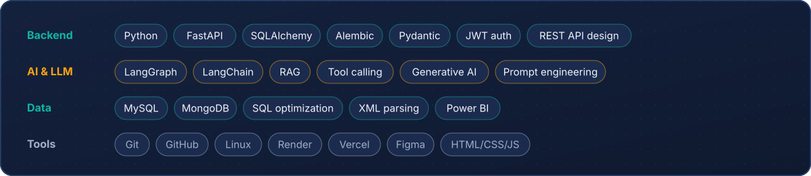

  
  
  
  

## Right now

- Building backend services at **Sigvitas** that turn 20+ years of **USPTO patent XML** into a normalized MySQL database queried at the scale of millions of records
- Shipping **Dayflow** — the expense & wallet module is done; journaling and tasks are next
- Going deeper into **agentic AI**: LangGraph workflows, tool calling and RAG on top of real backends

## Featured work

  
  

<table>
<tr>
<td width="50%" valign="top">

**Ziya** — the agent never invents a product or price. Every answer comes from a LangChain tool that calls a real FastAPI endpoint, with JWT-protected cart actions and thread-based memory.

</td>
<td width="50%" valign="top">

**Dayflow** — each income or expense entry runs in one database transaction, so balances never drift. Receipt uploads and soft delete are included, and stored files are cleaned up if anything fails.

</td>
</tr>
</table>

<b>More projects</b> — school & college backends, FastAPI and SQLAlchemy deep-dives

 

| Project | What it does | Stack |
|---|---|---|
| [Capstone School Database](https://github.com/RajeshR005/capstone-school-database) | School backend: users, classes, attendance, marks, fees, Excel/PDF ranking reports, token auth | FastAPI · SQLAlchemy · MySQL |
| [College Management System](https://github.com/RajeshR005/python-sqlalchemy-college-management) | Students, staff, courses, allocations and marks on a normalized schema | Python · SQLAlchemy |
| [FastAPI Practice](https://github.com/RajeshR005/fastapi) | CRUD, token auth, file uploads, dependency injection | FastAPI |
| [SQLAlchemy Hands-on](https://github.com/RajeshR005/SQLAlchemy) | Relationships, joins, aggregations, backrefs, subqueries | SQLAlchemy |
| [Python Fundamentals](https://github.com/RajeshR005/python) | Core concepts, scripting and automation | Python |

## Experience

**Software Engineer** · Sigvitas, Bengaluru · *Aug 2025 – present*
- Build and maintain scalable backend services and RESTful APIs with **Python & FastAPI** for enterprise applications
- Wrote Python utilities that parse **USPTO patent XML** and load **20+ years** of patent data into a normalized MySQL database
- Write optimized SQL and business logic that retrieves and processes **millions of patent records**

**Python Developer Intern** · Maestro Technologies, Coimbatore · *Mar 2025 – Jul 2025*
- Built backend modules and REST APIs with **FastAPI & SQLAlchemy**, and managed MySQL through the ORM
- Worked with the development team to ship features and resolve technical issues

**Education** · MCA, SNS College of Technology (2023–2025, CGPA 7.9) · B.Sc Computer Science, G. Venkataswamy Naidu College (2020–2023, CGPA 8.2)

## Toolkit

## Activity

  
  

  <picture>
    <source media="(prefers-color-scheme: dark)" srcset="https://raw.githubusercontent.com/RajeshR005/RajeshR005/output/github-snake-dark.svg" />
    <source media="(prefers-color-scheme: light)" srcset="https://raw.githubusercontent.com/RajeshR005/RajeshR005/output/github-snake.svg" />
    
  </picture>

  🏆 1st place, Technical Quiz &nbsp;·&nbsp; 📜 2nd place, Paper Presentation &nbsp;·&nbsp; ✔️ Python (Udemy), MySQL (PrepInsta) &nbsp;·&nbsp; 💪 NSS Volunteer

<h3 align="center">Building something where the backend has to be right? Let's talk.</h3>

  
  
  

rajeshr30072002@gmail.com &nbsp;·&nbsp; Tamil · English · Hindi

